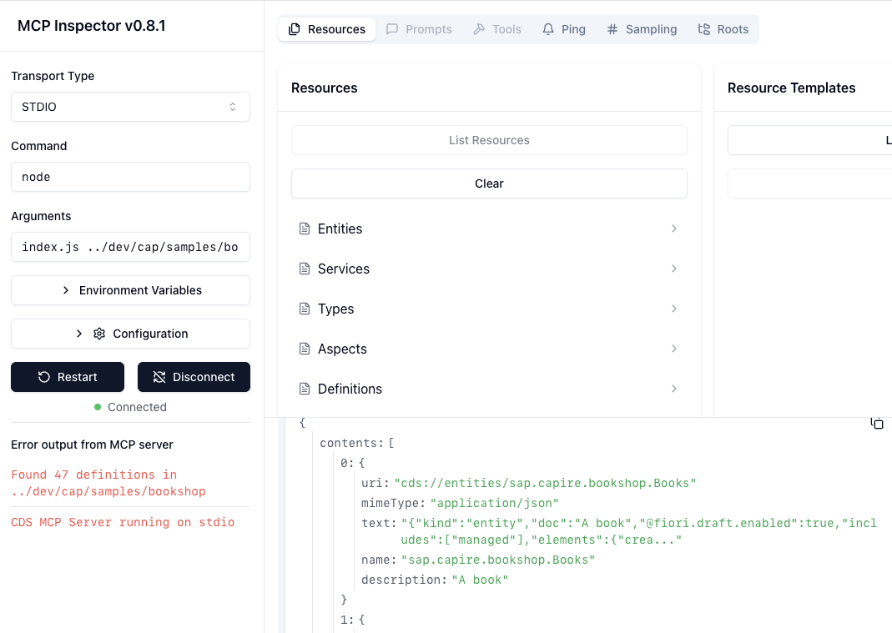

# MDC Server for CAP

A Model Context Protocol server that exposes CAP's CDS model as resources.

It's in an **alpha state** and uses a builtin CDS model ([CAP's bookshop sample](https://github.com/SAP-samples/cloud-cap-samples/tree/main/bookshop)).

## Setup

```sh
git clone https://github.com/chgeo/cds-mcp
cd cds-mcp
npm install
```

## Usage in VS Code

> [!CAUTION]
> At SAP, MCP in VS Code seems to be centrally **disabled** at the moment.
> Error is: _Unable to write chat.mcp.enabled because it is configured in system policy._

Use command `MCP: Add Server...` to register the server once.
- Select `command`.
- Set `node <your-repo>/index.js` as command.

In the _Chat_ panel, it should be available through the _Select tools_ button.

See the [VS Code docs](https://code.visualstudio.com/docs/copilot/chat/mcp-servers) for more.

## Usage in MCP Inspector

You can test the server with the _MCP Inspector tool_.
See the [MCP Inspector docs](https://modelcontextprotocol.io/docs/tools/inspector) for more.



## Components

### Resources

The server provides resources for
- Entities (`cds://entities`)
- Services (`cds://services`)
- Types (`cds://types`)
- Aspects (`cds://aspects`)
- All definitions (`cds://definitions`)